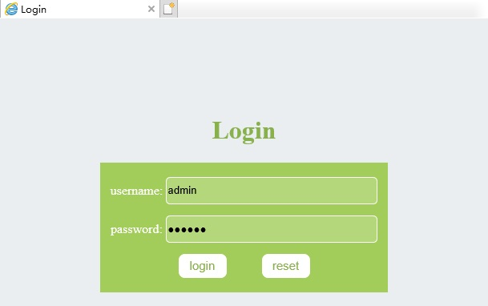
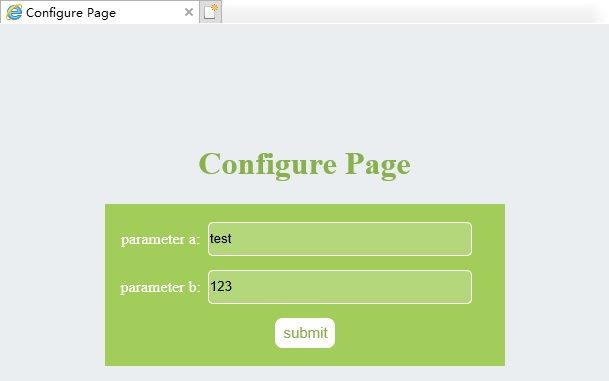

# 1.Overview

[Here](./example06.cpp) is an example of a simple web configuration page implemented using EVHttpServer.

# 2.Steps

## 2.1 Prepare

Before running the program, make sure that the html directory is at the same level as example06, and the html resource file is placed in the html directory.

## 2.2 Run the program

```shell
$ ./example06 
[I] EVHttpServer.cpp:210 [start] ThreadPool create thread num:5
```

## 2.3 Enter web page

Enter ip:8080 in the browser, the port number can be modified in the code.

## 2.4 Login

In the code, the valid username is: `admin` and the password is: `123456`



## 2.5 Setting parameters

After successful login, you will enter the configuration page. When the page loads, the previously configured value will be obtained. Click submit to set the new value.



